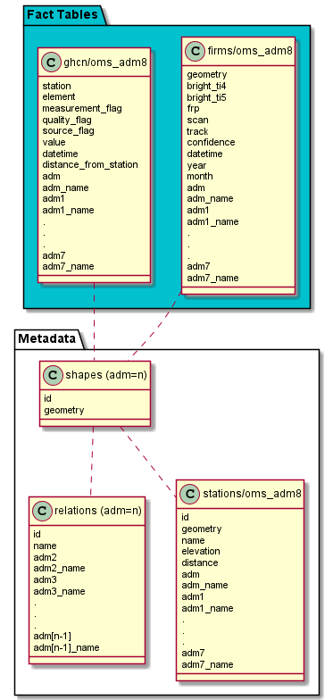
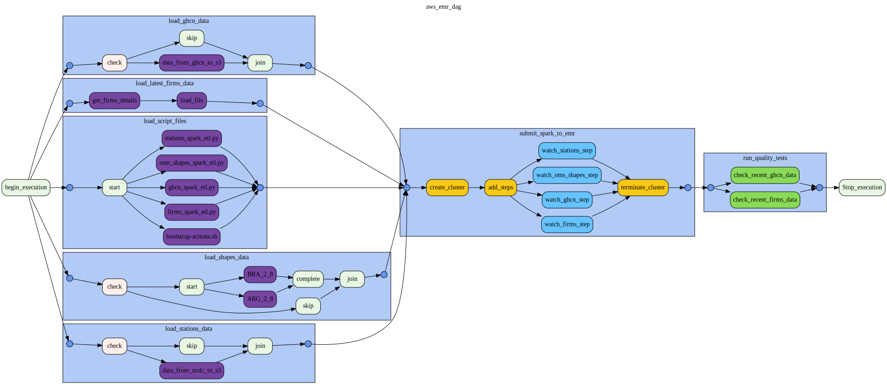
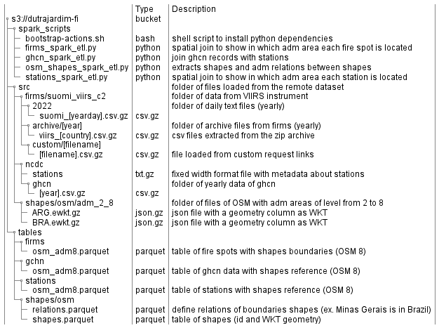
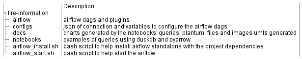

# [Fire Information](https://github.com/dutrajardim/fire-information)

[Github Link - Rafael Dutra Jardim](https://github.com/dutrajardim/fire-information)

### Table of content

- What you will find here (project scope)
- Exploring and assessing the data 
- The data model and the ETL process
- Example of analysis and technologies used
  - The database needed to be accessed by 100+ people
  - The pipelines would be run on a daily basis by 7 am every day and data increases by 100x
- Project structure
- How to install and execute the ETL (standalone airflow)

# What you will find here (project scope)

In this repository I wrote some Airflow DAGs (Directed Acyclic Graph) scripts to gather data from manifold datasets of related subjects, process and store the data creating a data lake that integrates those data to support analysis on them. \
Considering that the main organizations distributes their resources by administrative areas, the major goal of this project is to make possible compare historical events as wild fire and flood by administrative areas.


## Datasets

- Global Historical Climatology Network daily (GHCNd)
- Fire Information for Resource Management System (FIRMS)
- Administrative boundaries from Open Street Map databases (OSM-Boundaries)

# Exploring and assessing the data

### Global Historical Climatology Network daily (GHCNd)

This dataset contains records from loads of land surface stations, and was integrated and processed by the [National Center for Environment Information (NCEI)](https://www.ncei.noaa.gov/). Some of the variables from the NCEI's dataset explored in this repository project are average temperature and volume of precipitation. \
The paper [An Overview of the Global Historical Climatology Network-Daily Database](https://www1.ncdc.noaa.gov/pub/data/ghcn/daily/papers/menne-etal2012.pdf), by Matthew J. Menne, Imke Durre, Russell S. Vose, Byron E. Gleason, and Tamara G. Houston, offer a more detailed description about this dataset. As described in the referenced paper, it's not guarantee to have daily updates for all stations, and some of then have only historical data as we can observe in the chart below that shows in the first picture the stations available at Minas Gerais and in the second picture the stations that mede climate data available in April - 2022.  


The query used to plot this chart is available in the [Stations Analysis Notebook](https://github.com/dutrajardim/fire-information/blob/main/notebooks/stations_analysis.ipynb).

To see the repository of the GHCN dataset, you can follow [this link](https://www1.ncdc.noaa.gov/pub/data/ghcn/daily/). This project extracts the data by file transfer protocol, and makes use of **by year** csv file that is describe in the [README](https://www1.ncdc.noaa.gov/pub/data/ghcn/daily/by_year/readme-by_year.txt) on the NCEI's repository.  

### Fire Information for Resource Management System (FIRMS)

This dataset makes available Near Real-Time (NRT) active fire and thermal anomalies data within 3 hours of satellite observation from the Moderate Resolution Imaging Spectroradiometer (MODIS) and the Visible Infrared Imaging Radiometer Suite (VIIRS) instruments. \
The [Firms FAG](https://earthdata.nasa.gov/faq/firms-faq#ed-user-guides) describes the available data and how to download it. In this project was created a dag that extract data older then two months (archive data) by requesting a link by the [FIRMS form](https://firms.modaps.eosdis.nasa.gov/download/create.php), this link need to be set as an Airflow Variable. Another dag was created to download daily text files for the last two months via HTTPS and depends on a token to access the data. This both dags extract old data and is expected to be executed once. \
The major dag of this project, that is executed daily, also makes use of the token as a requirement of the FIRMS dataset.
The chart below shows a example of the data extracted from this datasets and the query is available in the [Firms Analysis Notebook](https://github.com/dutrajardim/fire-information/blob/main/notebooks/firms_analysis.ipynb).


### Administrative boundaries from Open Street Map databases (OSM-Boundaries)

OSM Boundaries is aimed to make easily to extract administrative boundaries such as country boarders or equivalents from the OpenStreetMaps databases. An user account of [OpenStreetMap](https://www.openstreetmap.org/user/new) is required to download the data, and so is a token to execute the DAGs of this project. Geo shapes extracted from the OSM dataset are used here to connect the data through administrative areas, so then we can create queries using this shapes references.
Different sources make up the dataset, so we can expect that some events (for example, fire spots) can be duplicated on processes like a join, as the location of an event can be within the overlapping shapes boundaries.

## The data model and the ETL process

### Data model

The image below shows how the data is saved after gathered from the datasets and processed. \
In this schema there is two fact table, and the idea is to concentrate the queries on them avoiding loads of join while we can select the columns and partitions we need before each analysis, as the data is saved as parquet files (columnar) in an object storage.



Both fact tables and the stations table are created based on one level of administrative area (e.g. adm8 that is country level in the OSM levels structure). The table shapes contains all boundaries levels and is partitioned by them (adm=n), for example, if we need cities shapes we can select the partition adm=8, and for countries shapes the partition is adm=2. This organization makes it possible to use other administrative boundaries databases as [GADM](https://gadm.org/) that is based in up to four administrative levels. So, for each level of fact tables we must configure the etl params to generate them, and at this moment just one is configured for use OSM dataset with adm8 (country).

### The ETL process

The main DAG (aws_emr_dag) is expect to be executed daily to extract the most recent data. \
The first part is responsible for load the remote data to s3 storage, and considering that the frequency of updates of some of the used datasets are not daily (e.g. OSM Boundaries), these process can be individually configured to be skipped, so Airflow will show in the history of execution when the updates were skipped. \
The second and third part (transforming and saving the data) occurs in a EMR cluster, the spark scripts are executed as steps of the cluster created during this process and after that the cluster is closed. \
The last part is the quality check test. The airflow operator used here makes use of the [DuckDB](https://duckdb.org/) to run sql queries on the s3 storage.



The image below show how the ETLs process store the files (Data Lake Structure).



### Data dictionary

The detailed description of the firms attributes fields (source) can be founded [here](https://earthdata.nasa.gov/earth-observation-data/near-real-time/firms/v1-vnp14imgt#ed-viirs-375m-attributes).

The detailed description of the GHCN attributes fields (source) can be founded [here](https://www1.ncdc.noaa.gov/pub/data/ghcn/daily/readme.txt)

- firms/osm_adm8.parquet
  - geometry - Point (CRS epsg:4326) of the fire spot in WKT (Well Know Text representation of geometry)
  - bright_ti4 - VIIRS I-4 channel brightness temperature of the fire pixel measured in Kelvin.
  - bright_ti5 - I-5 Channel brightness temperature of the fire pixel measured in Kelvin.
  - frp - FRP depicts the pixel-integrated fire radiative power in MW (megawatts).
  - scan - The algorithm produces approximately 375 m pixels at nadir. Scan and track reflect actual pixel size.
  - track - The algorithm produces approximately 375 m pixels at nadir. Scan and track reflect actual pixel size.
  - confidence - This value is based on a collection of intermediate algorithm quantities used in the detection process.
  - datetime - Datetime of VIIRS acquisition.
  - year - Year of acquisition (used as partition)
  - month - Month of acquisition (used as partition)
  - adm - The id of the administrative level 8 of the OSM organization (For Brazil is city but it can vary from country to country)
  - adm_name - The name of the administrative level 8 of the OSM organization 
  - adm[n] - The id of the administrative level N of the OSM organization
  - adm[n]_name - The id of the administrative level N of the OSM organization
- ghcn/osm_adm8.parquet
  - station - The station identification code.
  - element - The element type. There are five core elements as well as a number of addition elements. The five core elements are: PRCP = Precipitation (tenths of mm); SNOW = Snowfall (mm); SNWD = Snow depth (mm); TMAX = Maximum temperature (tenths of degrees C); TMIN = Minimum temperature (tenths of degrees C).
  - measurement_flag - The measurement flag (e.g. B = precipitation total formed from two 12-hour totals).
  - quality_flag - The quality flag (e.g. W = temperature too warm for snow)
  - source_flag - The source flag (e.g. C = Environment Canada)
  - value - The value of the measurement.
  - datetime - The datetime of the observation.
  - distance_from_station - Distance from the adm to the station (0 when the station is inside of the administrative area).
  - adm - The id of the administrative level 8 of the OSM organization (For Brazil is city but it can vary from country to country)
  - adm_name - The name of the administrative level 8 of the OSM organization 
  - adm[n] - The id of the administrative level N of the OSM organization
  - adm[n]_name - The id of the administrative level N of the OSM organization
- stations/osm_adm8.parquet
  - id - The station identification code.
  - geometry - Point (CRS epsg:4326) indicating the station locations in WKT (Well Know Text representation of geometry)
  - name - Name of the stations
  - elevation - The elevation of the station (in meters, missing = -999.9)
  - distance - Distance from the adm to the station (0 when the station is inside of the administrative area).
  - adm - The id of the administrative level 8 of the OSM organization (For Brazil is city but it can vary from country to country)
  - adm_name - The name of the administrative level 8 of the OSM organization 
  - adm[n] - The id of the administrative level N of the OSM organization
  - adm[n]_name - The id of the administrative level N of the OSM organization
- shapes
  - id - Id of the shape defined by OSM.
  - geometry - Polygon (CRS epsg:4326) in WKT (Well Know Text representation of geometry).
  - adm - The id of the administrative level 8 of the OSM organization.

# Example of analysis and technologies used

Some examples/results of queries that can be done are in the [notebooks folder](https://github.com/dutrajardim/fire-information/tree/main/notebooks). For that was used pyarrow to load the parquet files from S3 to local computer memory, and then used DuckDB for analysis. As the analysis need to be executed in more data (more partitions), a best solution would be to use another tools like PrestoDB and AWS Athena (AWS Glue can also help) in a AWS environment.

## Support for horizontal scale

### The database needed to be accessed by 100+ people

Amazon S3 offer a virtually unlimited scalability, and we can leverage a content distribution network (CDN) service on AWS to scale further by caching and serving the frequently requested content from 50+ edge location around the globe. So the data can be access by 100+ people. \
Other solutions are available as [MINIO](https://min.io/) that also offer a horizontally scale of the infra through a concept called [Server Pools](https://min.io/product/scalable-object-storage) and can be launched in EC2 instances, but this solution is harder to scale. \
For Amazon Athena there are some limitations ([quotas](https://docs.aws.amazon.com/athena/latest/ug/service-limits.html)) that are applied mainly per account or per query. For example we can call the APIs GetQueryExecution and GetQueryResults up to 100 times per second without the burst capacity. This solution is very attractive when we point that there is no need for download the data before the analysis, everything will be running on Amazon and then we need to get just the result (download the summary of the data).

### The pipelines would be run on a daily basis by 7 am every day and data increases by 100x

As data increases, for example selecting more countries to download from OSM, will result in an increase in the daily join task and so in the time taken by the scripts to complete the DAG execution. To guarantee that the data will be available when we need it, we can easily increase the number of executors in the EMR Cluster. 

# Project structure



# How to install and execute the ETL (standalone airflow)

## Install and start the Airflow standalone environment

To create a virtual environment with conda, run the following commands:

```console
$ conda create myenv python=3.9
$ ..
$ conda activate myenv
```

Download the project source code with the following commands in the Linux shell console, then install the dependencies and start the airflow server (using python >= 3.9):

```console
$ git clone https://github.com/dutrajardim/fire-information.git
$ ...
$ cd fire-information
$ chmod +x airflow_install.sh
$ ./airflow_install.sh
$ ...
$ chmod +x airflow_start.sh
$ ./airflow_start.sh
```

Every time we call airflow command, it will check for the airflow environment variables. So, for export those variables persistently we can run the follow command that will write the variables to the ~/.bashrc file:

```console
$ ./set_airflow_env.sh
``` 

## Configure and running the ETL

Fill in the configuration files in the config folder and run the follow commands. Make sure to execute the commands with the same python environment used in the airflow installation.

```console
$ airflow connections import configs/connections.json 
$ airflow variables import configs/variables.json
```

To start the dag:
```console
$ airflow dags unpause aws_emr_dag
$ airflow dags trigger aws_emr_dag
```